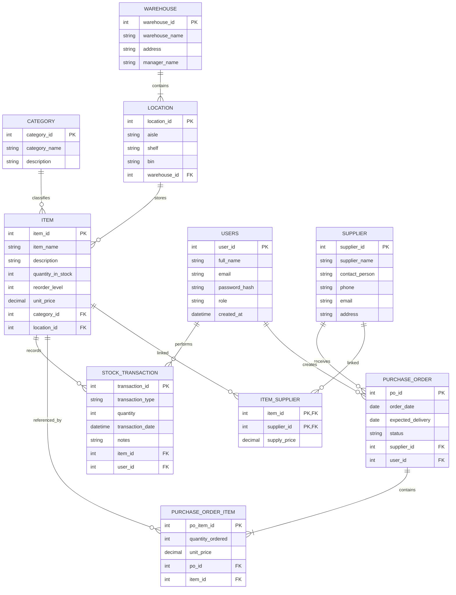

```mermaid
erDiagram
    CATEGORY ||--o{ ITEM : classifies
    WAREHOUSE ||--|{ LOCATION : contains
    LOCATION ||--o{ ITEM : stores
    ITEM ||--o{ STOCK_TRANSACTION : records
    USERS ||--o{ STOCK_TRANSACTION : performs
    SUPPLIER ||--o{ PURCHASE_ORDER : receives
    USERS ||--o{ PURCHASE_ORDER : creates
    PURCHASE_ORDER ||--|{ PURCHASE_ORDER_ITEM : contains
    ITEM ||--o{ PURCHASE_ORDER_ITEM : referenced_by
    ITEM ||--o{ ITEM_SUPPLIER : linked
    SUPPLIER ||--o{ ITEM_SUPPLIER : linked

    CATEGORY {
        int category_id PK
        string category_name
        string description
    }
    WAREHOUSE {
        int warehouse_id PK
        string warehouse_name
        string address
        string manager_name
    }
    LOCATION {
        int location_id PK
        string aisle
        string shelf
        string bin
        int warehouse_id FK
    }
    USERS {
        int user_id PK
        string full_name
        string email
        string password_hash
        string role
        datetime created_at
    }
    SUPPLIER {
        int supplier_id PK
        string supplier_name
        string contact_person
        string phone
        string email
        string address
    }
    ITEM {
        int item_id PK
        string item_name
        string description
        int quantity_in_stock
        int reorder_level
        decimal unit_price
        int category_id FK
        int location_id FK
    }
    ITEM_SUPPLIER {
        int item_id PK,FK
        int supplier_id PK,FK
        decimal supply_price
    }
    STOCK_TRANSACTION {
        int transaction_id PK
        string transaction_type
        int quantity
        datetime transaction_date
        string notes
        int item_id FK
        int user_id FK
    }
    PURCHASE_ORDER {
        int po_id PK
        date order_date
        date expected_delivery
        string status
        int supplier_id FK
        int user_id FK
    }
    PURCHASE_ORDER_ITEM {
        int po_item_id PK
        int quantity_ordered
        decimal unit_price
        int po_id FK
        int item_id FK
    }
```
